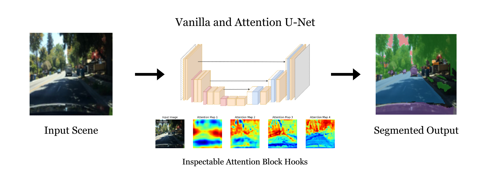

<h1 align="center">BDD100K: Semantic Segmentation</h1>
<div align="center"><i><small>This project was concluded in the Deep Learning for Image and Signals (dlbs) course at <a href="http://fhnw.ch/en">FHNW</a><small></i><div>

<br/>

<div align="center">
This repository contains a project that trains <b>Vanilla U-Net</b> and <b>Attention U-Net</b> models on the <b>BDD100K</b> dataset for a <b>semantic segmentation</b> task. The project explores multiple experimental setups, hyperparameter tunings, and training schedules using <b>Hydra</b> configurations.
</div>

<br/>

<div align="center">
  
</div>

---

## Table of Contents
1. [Overview](#overview)
2. [Key Files and Folders](#key-files-and-folders)
3. [Main Notebook & Analysis](#main-notebook--analysis)
4. [Report](#report)
5. [Installation](#installation)
6. [Usage](#usage)
7. [Project Structure](#project-structure)
8. [License](#license)

---

## Overview

- **Goal**: Investigate how two segmentation models (a Vanilla U-Net and an Attention U-Net) perform on urban (city) vs. non-urban scenes within the BDD100K dataset.
- **Research Question**: *How do segmentation models perform between scenes of city streets and non-city streets in the BDD100K dataset?*
- **Architecture**: 
  - **Vanilla U-Net**: Traditional encoder-decoder setup with skip connections.
  - **Attention U-Net**: Incorporates attention blocks to refine skip connections.
- **Highlights**:
  - Extensive experimentation with different hyperparameters (learning rate, weight decay, dropout).
  - Logging and model management using **Weights & Biases** (wandb).
  - Semantic segmentation classes remapped from `19` original classes down to 5 major classes.

---

## Key Files and Folders

| **Path**                                                   | **Description**                                                                                        |
|------------------------------------------------------------|--------------------------------------------------------------------------------------------------------|
| [`main.ipynb`](./main.ipynb) or [`main.html`](./main.html) | **Primary Notebook** showcasing the entire training process, results, and in-depth analysis.           |
| [`report/out/main.pdf`](./report/out/main.pdf)             | **Project Report** summarizing the main findings and results in PDF format.                            |
| [`train.py`](./train.py)                                   | Main **Hydra**-based training script. Reads configs from `configs/` and orchestrates training.         |
| [`trainer.py`](./trainer.py)                               | Custom **Trainer** class handling the training loop, evaluation, logging, and model saving logic.      |
| [`analyzer.py`](./analyzer.py)                             | Analysis utilities for plotting training/validation curves, sample predictions, and comparing runs.    |
| [`requirements.txt`](./requirements.txt)                   | Python dependencies needed to run the project.                                                         |
| [`configs/`](./configs/)                                   | Hydra configuration files (experiments, dataset settings, model definitions, etc.).                    |
| [`core/`](./core/)                                         | Implementations of **U-Net**, **Attention U-Net**, and custom modules (e.g., `focal_loss.py`).         |
| [`data/`](./data/)                                         | Dataset utilities, including the `BDD100KDataset` and preprocessing/remapping helpers.                 |
| [`report/`](./report/)                                     | LaTeX report and figures folder.                                                                       |
| [`scripts/`](./scripts/)                                   | Various utility scripts (e.g., cluster job submission with Slurm).                                     |
| [`train.slurm`](./train.slurm)                             | Example SLURM script for running training on a compute cluster (1 GPU).                                |

---

## Main Notebook & Analysis

- **Main Notebook**:  
  - Refer to [`main.ipynb`](./main.ipynb) or its HTML export [`main.html`](./main.html).  
  - Contains **explanations, code snippets, plots, and analysis** of the experimental runs.  
  - Showcases **example predictions**, **attention maps**, **training curves**, and **test performance**.

---

## Report

- A thorough **PDF report** located at:
  - [`report/out/main.pdf`](./report/out/main.pdf)

It includes:
- Discussion of the **research question** and **methodology**.  
- Key findings and side-by-side **comparisons** of city vs. non-city IoU.  
- Insights into the **Attention U-Net** advantages, limitations, and sample visualizations.

---

## Installation

1. **Clone** this repository:
   ```bash
   git clone https://github.com/<your-username>/dlbs-segmentation.git
   ```

2. **Create and activate** a Python virtual environment (optional but recommended):
    ```bash
    pytjon3 -m venv .venv
    ```

3. Install dependencies:
    ```bash
    pip install -r requirements.txt
    ```

4. Make sure you have your BDD100K dataset organized in ./data/bdd100k/ following the paths used in the configs (images and masks). The dataset can be downloaded at https://doc.bdd100k.com/download.html

---

## Usage

1. Local Training
You can run a training experiment locally using any of the provided configs:

```bash
# Example: train a Vanilla U-Net with CrossEntropy (default)  
python3 train.py experiment=unet_baseline
```
- Hydra's multi-run options or sweeps can be used to systematically explore different parameters.

2. Slurm Job Submission (if applicable)
If you have access to a Slurm-based cluster, you can use the sample `train.slurm` or `scripts/submit_job.sh` to submit a job:

```bash
# usage: ./scripts/submit_job.sh <experiment_name> <slurm-time-limit>
./scripts/submit_job.sh unet_overfit_1 "02:00:00"
```

---

## Project Structure

Project Structure
A simplified view of the repository:

```bash
dlbs-segmentation/
├── analyzer.py                  # Analysis & plotting utilities
├── configs/                     # Hydra config files
│   ├── experiment/              # Configs for different experiments
│   ├── dataset/                 # Dataset definitions
│   ├── model/                   # Model definitions
│   ├── optimizer/               # Optimizer definitions
│   └── trainer/                 # Trainer defaults
├── core/                        # Model implementations & modules
│   ├── unet.py
│   ├── vanilla_unet.py
│   ├── attention_unet.py
│   ├── modules.py
│   └── focal_loss.py
├── data/                        # Data handling utils
│   ├── bdd100k_dataset.py
│   ├── utils.py
│   └── resolved_names.py
├── report/                      # LaTeX report & figures
│   ├── main.tex
│   ├── out/
│   │   └── main.pdf             # Final report PDF
│   └── chapters/
├── scripts/                     # Shell scripts for HPC usage
│   ├── download.sh
│   ├── submit_job.sh
│   └── upload.sh
├── train.py                     # Main training entry point (Hydra)
├── trainer.py                   # Custom Trainer class
├── train.slurm                  # Example Slurm submission script
├── requirements.txt             # Project dependencies
└── README.md                    # You're here!
```